<div align="center">

```
███████╗██╗██████╗ ██╗  ██╗██╗██╗    ██╗███████╗
██╔════╝██║██╔══██╗██║  ██║██║██║    ██║██╔════╝
███████╗██║██████╔╝███████║██║██║ █╗ ██║█████╗  
╚════██║██║██╔═══╝ ██╔══██║██║██║███╗██║██╔══╝  
███████║██║██║     ██║  ██║██║╚███╔███╔╝███████║
╚══════╝╚═╝╚═╝     ╚═╝  ╚═╝╚═╝ ╚══╝╚══╝ ╚══════╝
```

</div>

---

```bash
$ whoami
> SiphiweRadebe
```

```yaml
name:       Siphiwe Radebe
pronouns:   he/him
location:   South Africa 🇿🇦
linkedin:   linkedin.com/in/siphiwe-radebe-8063b41ba
status:     open to collaboration
```

---

```bash
$ cat skills.txt
```

<p align="center">
  
</p>

<p align="center">
  
  
  
  
  
  
</p>

---

```bash
$ metrics --user SiphiweRadebe --section overview
```

<p align="center">
  
</p>

---

```bash
$ git log --graph --all --format='%C(auto)%h %s'
```

<p align="center">
  
</p>

---

```bash
$ cloc --by-lang ~/projects/**
```

<p align="center">
  
</p>

---

```bash
$ cat ~/.commit_patterns
```

<p align="center">
  
</p>

---

```bash
$ ls ~/projects
```

<p align="center">
  
</p>

```bash
$ git log --author="SiphiweRadebe" --oneline -10
```

<p align="center">
  
</p>

---

```bash
$ ls ~/.github/topics/
```

<p align="center">
  
</p>

---

```bash
$ cat ~/.github/achievements
```

<p align="center">
  
</p>

---

```bash
$ curl -s https://linkedin.com/in/siphiwe-radebe-8063b41ba
```

<p align="center">
  <a href="https://linkedin.com/in/siphiwe-radebe-8063b41ba">
    
  </a>
  &nbsp;
  <a href="https://github.com/SiphiweRadebe">
    
  </a>
  &nbsp;
  
</p>

---

<p align="center">
  
</p>

```bash
$ exit
> Connection closed. ✓
```
